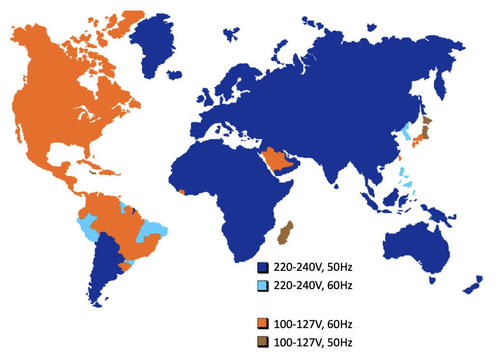

# Reusable Codes for Biomedical Signal Processing and MachineLearning
*Best coding practices for scalable and generalizable biomedical signal processing and machine learning*

## General coding styles

### Presumptions on data format and length
- Tall vs fat conventions in multichannel data representation.
- Sample indexing: Running across vector borders

### Hardcoded parameters
Should be avoided. Any ad hoc parameter should be passed asinput arguments to functions. Hardcoded parameters should be avoided as much aspossible, unless when they have been found through optimization or have been setby design. Hardcoded parameters suffer from lack of generalizability.

### Data paths and file listings
Data paths should be only passed as input arguments and should not be hardcoded Well-designed codes should be cognizant of path separators across different OS, such as the `/` symbol in Linux/MacOS vs `\` in Windows machines.

### Empty lists
Codes should not presume that all functions will return with success. Examples of function failures include:

1. Unresolved paths
2. Unfound data files
3. Indexes for unmet conditions in search arrays

## Time-series analysis

### Sampling frequency
Generalizable codes should read the sampling frequency from the metadata and compute any relevant parameters from the sampling frequency

#### Implicit dependency on sampling frequency
Discrete filter designs, wavelet scale levels, averaging window sizes, number of discrete Fourier transform points, time scale of differentiation, and frequency bin indexes are examples, which are implicitly a function of the sampling frequency and are mistakenly hardcoded.

#### Workaround for fixed designs
Ifa code has been optimized for a specific sampling frequency, resampling any given signal to that specific sampling frequency can be used as a workaround for applying the optimized codes on arbitrary datasets. 

### Powerline frequency
Countries across the globe use either 50Hz or 60Hz as their powerline (also known as the *mains*) frequency, as shown below. The knowledge of the powerline frequency is essential for the efficient rejection of powerline interferences from biosignals.The mains frequency should be stored in the metadata and used parametrically for designing notch filters, whenever required.

*Originally created by [Conrad H. McGregor](https://commons.wikimedia.org/wiki/File:Map_of_the_world_coloured_by_voltage_and_frequency.png)*

### Physical units
All physiological data have physical units. Biosignal processing and machine learning algorithms should be designed to work seamlessly,regardless of the signal units through proper scaling. For example, changing the amplitude units on an ECG signal from millivolts to microvolts or volts should not impact the performance of the algorithms. Similarly changing time units from seconds to milliseconds should not impact time-based measurement. Another example is measurements made in SI unit (metric system) vs the US Customary unit, which only change our unit of measurements, but should not impact our inference of the physiological phenomenon. Note that algorithms may still rely on absolute amplitudes or time-scales of data in their properphysical units or may even be designed for a specific unit of measurements. The units used to design an algorithm should be well-documented in the codebase, enabling the users to apply appropriate unit conversions whenever required.

## Machine Learning

